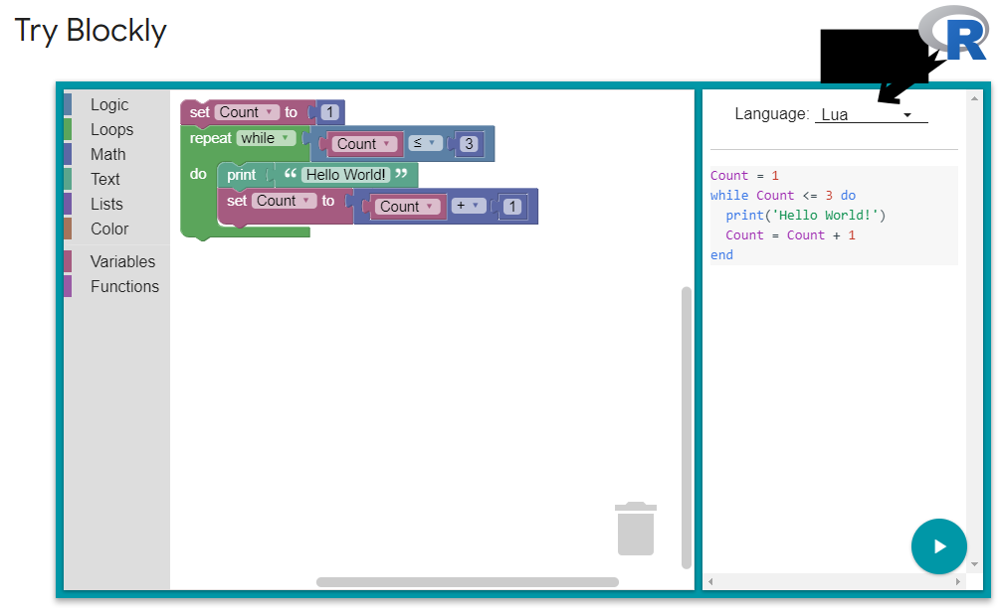

# blocker
Scratch/ Blockly interface to generate R code for teaching beginners

re: 
  https://scratch.mit.edu/developers
  
  https://developers.google.com/blockly/
  
  http://pencilcode.net/
  
  
